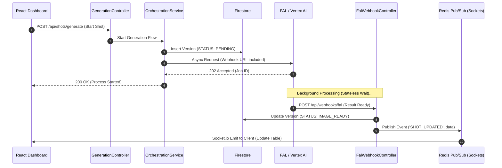
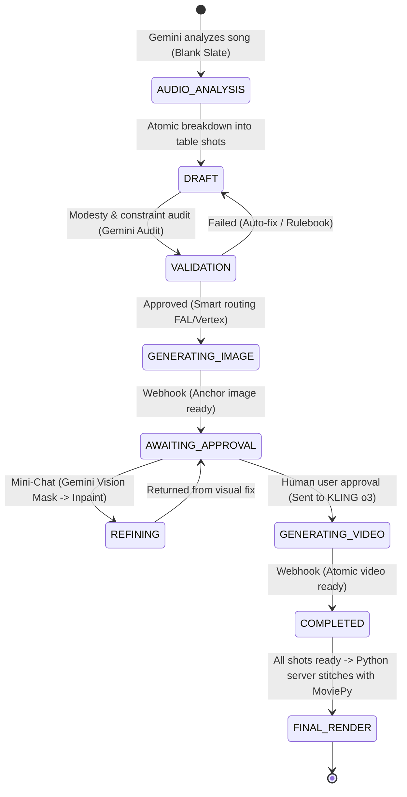

# Atomic PRD V2.2: AI Cinematic Video Production Platform ("Project Miri")
**Status:** Ready for Dev | **Architecture:** Cloud-Native Event-Driven MVC | **Core Languages:** Node.js (TypeScript) & Python.

## 1. Tech Stack & Cloud Infrastructure (DevOps)
* **Backend API:** `Node.js` with `Express.js`, hosted on **GCP Cloud Run** for long-running executions (up to 60 minutes) and automatic scaling (Scale-to-Zero).
* **Distributed Real-time Communication (WebSockets):** Since Cloud Run operates on an Autoscaling model (multiple concurrent instances), WebSockets must be implemented using `Socket.io` with a **Redis Pub/Sub** adapter, or alternatively using **Firestore Realtime Updates** (`onSnapshot`), to ensure status messages are synchronized across all active containers.
* **Post-Processing:** A secondary server/process in **Python** utilizing the `moviepy` library to stitch silent video clips together and sync them with the original MP3 audio track.
* **Frontend:** React SPA.
* **Database:** **Firestore** (NoSQL). Strictly follows the **Immutable Storage** pattern – no overwriting of existing data, only appending new `Versions`.
* **System Resilience (Circuit Breaker):** Implementation of the Circuit Breaker pattern for all external API providers (FAL, KLING, Vertex) to prevent infinite loops and protect budget constraints.

## 2. Test-Driven Development (TDD) & INVEST Principles
To prevent AI coding agents from producing fragile "Vibe Coding", the development strategy relies on strict rules:
* **TDD Protocol:** The coding agent must start by writing a failing Unit Test (Red), writing the minimal code required to pass it (Green), and only then performing a Refactor.
* **YAGNI Principle:** Do not write future logic that is not strictly required to pass the current test.
* **Atomicity (INVEST):** Every feature or module must be developed as a task that adheres to INVEST principles (Independent, Negotiable, Valuable, Estimable, Small, Testable).

## 3. Master Context & AI Pipeline Prompt Engineering
* **Character Profile (Miri):** A 12-year-old girl on the autism spectrum. Her visual representation MUST be achieved *exclusively* via the standard LoRA weights `miriN14` in FLUX.2.
* **Strict Physical Constraints:** Mandatory inclusion of the terms `Child physique`, `Young girl`, `Loose fit`, `Heavy fabric`, `Mid-calf`. The term `Mouth CLOSED` must be included to prevent morphing.
* **Start Frame Principle:** Any prompt destined for video generation (Claude) must FIRST describe the static, resting state of the character before describing any action.
* **Metadata Tagging:** Every prompt must include an identification prefix: `[ShotID]_[VersionID]_[ModelCode]`.

## 4. Dynamic Scene Engine & Knowledge Management (RAG)
* **Blank Slate:** The system starts empty. Gemini 1.5 Pro/3.1 Pro analyzes the MP3 file and lyrics to dynamically generate new scenes and shots including automated Timestamps.
* **Active Rulebook Engine (Failure Learning):** Utilizes Vertex AI Vector Search. When a user rejects an image due to a visual failure, Gemini Vision will analyze the failure, formulate a new system rule, and automatically update the vector database to prevent the issue from recurring in future shots.

## 5. Server Architecture (MVC) & Smart Orchestration
The server operates on a **Stateless Execution** model – dispatches a task and terminates the run. Responses are handled asynchronously via Webhooks.



## 6. Advanced Consistency Mechanics
1. **FLUX.2 Multi-Reference:** Sending reference images from previous shots to prevent artistic continuity jumps.
2. **KLING o3 Anchor Frames:** Generating both a Start Frame and an End Frame for precise video interpolation.
3. **Motion Brush:** Injecting motion vectors for targeted area animation.

## 7. Hierarchical Database Schemas (Zod to Firestore)

```typescript
// Zod Schema: User & Project Config Object (Global Settings)
const ProjectConfigSchema = z.object({
  projectId: z.string().uuid(),
  projectName: z.string(),
  globalSettings: z.object({
    llmModel: z.string(), // e.g., "gemini-3.1-pro-preview"
    imageModel: z.string(), // e.g., "flux-2-turbo"
    videoModel: z.string(), // e.g., "kling-o3"
    loraWeightsId: z.string(), // e.g., "miriN14"
    requireHumanApproval: z.boolean().default(true)
  }),
  creationTimestamp: z.string().datetime()
});

// Zod Schema: Agent Configs (Dynamic Models)
const AgentConfigSchema = z.object({
  configId: z.string().uuid(),
  role: z.enum(["ORCHESTRATOR", "AUDITOR", "VISION_ANALYZER", "DIRECTOR"]),
  modelString: z.string(), 
  active: z.boolean(),
  updatedAt: z.string().datetime()
});

// Zod Schema: Shot Metadata
const ShotSchema = z.object({
  shotId: z.string().uuid(),
  sceneId: z.string().uuid(),
  timestamps: z.object({ startMs: z.number(), endMs: z.number() }),
  lyricsSnippet: z.string(),
  status: z.enum(["DRAFT", "AWAITING_APPROVAL", "REFINING", "GENERATING_VIDEO", "COMPLETED", "FAILED"]),
  versions: z.array(z.string().uuid()),
});
```

### State Machine: The Lifecycle of a Shot
To prevent model hallucinations regarding statuses, the coding agent is strictly required to follow this flow:

